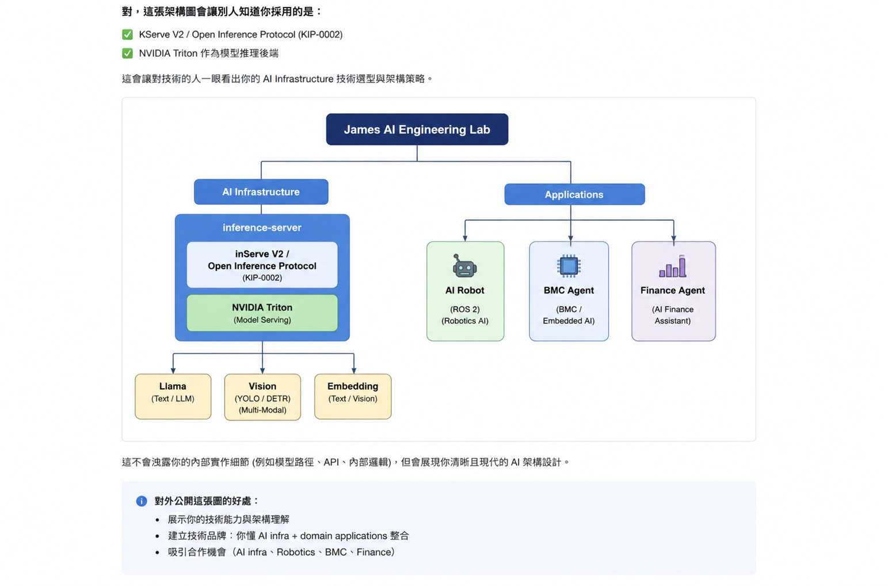

# James AI Engineering Lab

**James AI Engineering Lab** is a personal AI engineering lab focused on reusable AI infrastructure and real-world AI systems across robotics and embedded engineering.

The goal is to build common AI infrastructure once, then reuse it across multiple domain applications without coupling applications to specific model implementations.

## Focus Areas

### AI Infrastructure

Designing reusable, containerized model-serving infrastructure with standardized inference interfaces for text, vision, embedding, audio, and future multimodal workloads.

### Robotics & Embodied AI

Building ROS 2 and NVIDIA Isaac Sim based robot systems that connect perception, AI reasoning, decision making, skills, and robot operation through clean runtime boundaries.

### Embedded / BMC AI

Applying AI agents and automation to embedded and BMC engineering workflows, including engineering data processing, issue analysis, and productivity tooling.

## Core Infrastructure

### `inference-server`

General-purpose containerized AI model-serving infrastructure shared by multiple applications.

Key design principles:

- Application-independent model serving
- Containerized runtime environment
- KServe V2 / Open Inference Protocol compatible interfaces
- NVIDIA Triton based serving architecture
- Configuration-driven model and backend selection
- Support for text, vision, embedding, audio, and future multimodal capabilities
- Applications depend on AI capabilities rather than specific model implementations

## Projects

| Repository | Purpose |
|---|---|
| `inference-server` | General-purpose AI model serving and inference infrastructure |
| `ai-robot-system` | ROS 2 based robot intelligence and runtime architecture |
| `isaac-projects` | NVIDIA Isaac Sim projects, simulation environments, and validation assets |
| `bmc-job-agent` | AI-assisted BMC engineering workflow and automation |
| `finance-agent` | Future AI-assisted financial and investment analysis |

## Architecture Principles

**Build AI infrastructure once, then reuse it across domain applications.**

The architecture separates responsibilities into clear layers:

- **Inference infrastructure** owns model execution, acceleration, lifecycle, and standardized serving interfaces.
- **Applications** own domain-specific workflows, semantics, reasoning, and business logic.
- **Integration boundaries** remain model-independent so models and inference backends can evolve without requiring application architecture changes.

This allows robotics, embedded engineering, finance, and future AI applications to share the same underlying inference infrastructure while remaining independently developed and deployed.

## Technology Direction

`Docker` · `NVIDIA Triton` · `KServe V2` · `Open Inference Protocol` · `ROS 2` · `NVIDIA Isaac Sim` · `Meta Llama` · `Computer Vision`
